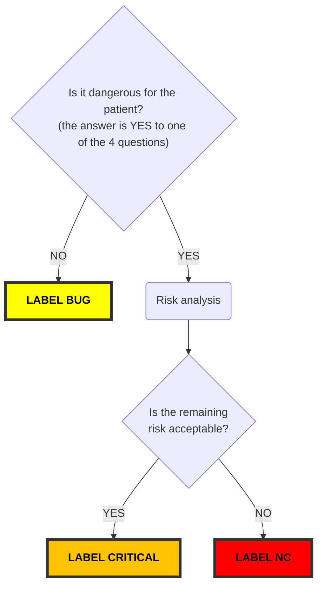

#### Origin
  
- Technician
- Physician
- Marketing
- RD
- After Sales Service

_keep only the necessary lines_

#### Criticality questions

~Strike~ the wrong answer

- Can the patient suffer damage due to defective ventilation? **(ventilation)** YES/NO
- Does this cause misinterpretation of the ventilation data? **(settings/monitoring)** YES/NO
- Does this cause a lack of prevention to the patient's entourage? **(alarms)** YES/NO
- Does this cause a malfunction of the product or one of its assemblies? **(hardware)** YES/NO

#### Labelling



_Complete labelling regarding the [workflow result](https://github.com/eove/.github/) (visualise it in preview) and erase this chapter once labelling done_

## Description

#### What is the problem to solve?

```
Given
When
Then
```

#### Proposal _optionnal_

_Complete with your idea, the feedback from the field, ask for help, etc..._
