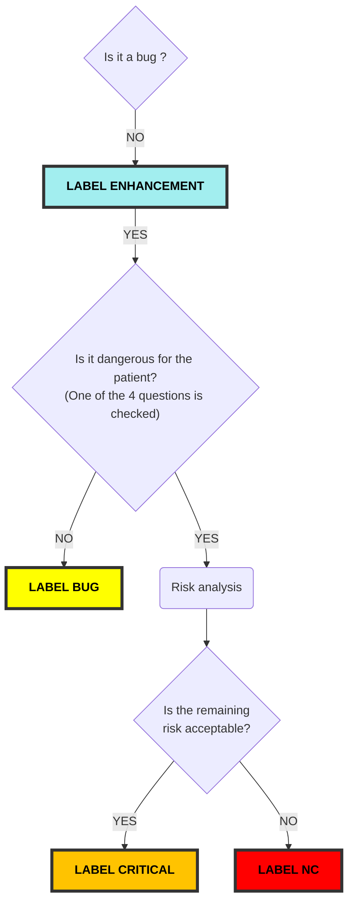

# EOVE's organisation-wise configuration files
                                              
To decide which label to use for an issue, follow this chart.

```mermaid
graph TD
    BUG_QUESTION{"Is it a bug ?"}
    --NO--> ENHANCEMENT[LABEL ENHANCEMENT]
    --YES--> DANGER_QUESTION{"Is it dangerous for the patient?<br/>(One of the 4 questions is checked)"}
    DANGER_QUESTION --NO--> BUG[LABEL BUG]
    DANGER_QUESTION --YES--> RISK(Risk analysis)
    --> RISK_QUESTION{Is the remaining<br/>risk acceptable?}
    RISK_QUESTION --YES--> CRITICAL[LABEL CRITICAL]
    RISK_QUESTION --NO--> NON_CONFORM[LABEL NC]

classDef Tag stroke:#333,color:#000, stroke-width:4px, font-weight: bold
class BUG,CRITICAL,NON_CONFORM,ENHANCEMENT Tag;
style ENHANCEMENT fill:#A2EEEF
style BUG fill:#FFFF00
style CRITICAL fill:#FFC300
style NON_CONFORM fill:#FF0000
```
